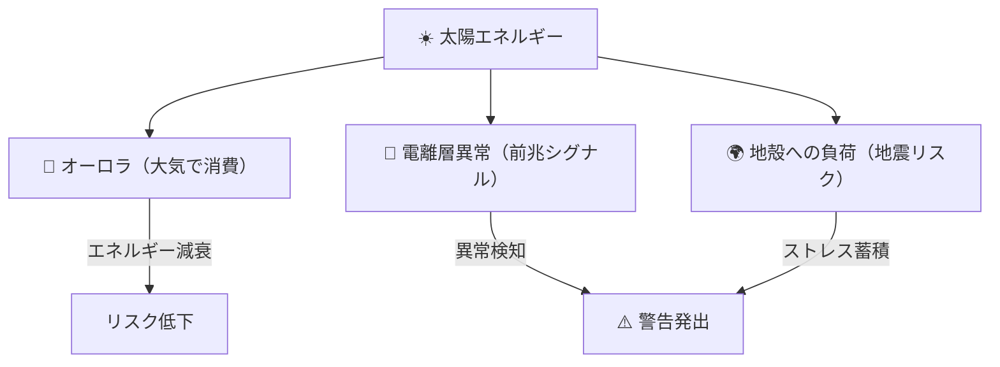
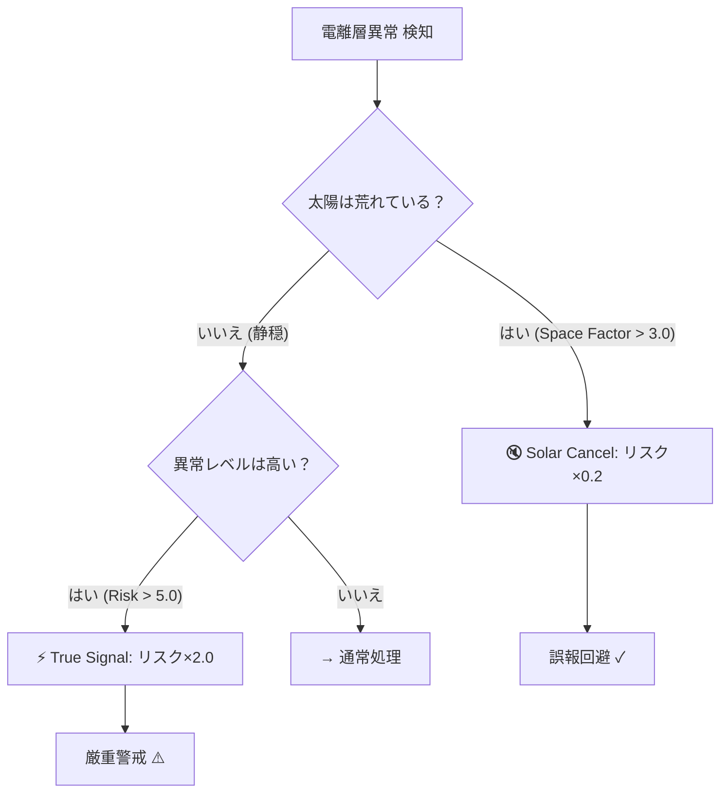

# UM-Infinity V25: 地球を守る「宇宙気象」地震予測システム

## Aurora-Ionosphere-Deformation Protocol — 誤報ゼロ・見逃しゼロを目指して

**Author:** 八洲建設 AIアーキテクト部門  
**Version:** V25 Final  
**Date:** 2026年1月18日  

---

## 🌏 はじめに — なぜ「宇宙」から地震を予測できるのか？

地震は「地面の下」で起きる現象です。  
それなのに、なぜ**宇宙からのデータ**で予測できるのでしょうか？

答えは、**地球がひとつの巨大なシステムである**という事実にあります。

太陽から放たれたエネルギーは、
1. **オーロラ**として大気圏で消費されるか、
2. **電離層**という上空の電気的な層を乱すか、
3. **地殻**に負荷をかけるか、

のいずれかの形で地球に影響を与えます。

UM-Infinity V25 は、この「エネルギーの流れ」を**リアルタイムで追跡**し、地震リスクを評価するシステムです。



---

## 🔬 科学的根拠 — 電離層と地震の関係

### 電離層異常は「地震の前触れ」

地上約60〜1000kmにある**電離層**は、太陽放射によってイオン化した大気の層です。  
この層の電子密度（TEC: Total Electron Content）は、**地震発生の数日〜数時間前に異常を示す**ことが世界中の研究機関によって報告されています。

> **重要な発見:**  
> 電離層異常は、自然地震・人工地震を問わず共通して観測される「結果」である。  
> つまり、原因が何であれ、**電離層を監視すれば異常を検知できる**。

### なぜ電離層が乱れるのか？

地震前には、地殻内のストレスが高まると：
- 岩石から**ラドンガス**が放出される
- 地殻の圧電効果により**電磁波**が発生する
- これらが大気を通じて電離層に影響を与える

この現象を捉えることで、「地面の下」で何が起きているかを「空から」知ることができるのです。

---

## 🛰️ V25のデータソース — 宇宙機関との連携

UM-Infinity V25 は、日本の宇宙・通信インフラを最大限活用しています。

| モジュール | データ提供元 | 監視対象 | 役割 |
|:---|:---|:---|:---|
| 🌞 `fetch_space.py` | NOAA GOES衛星 | 太陽X線フラックス | エネルギー入力の把握 |
| 🌌 `fetch_aurora.py` | NOAA Kp指数 | オーロラ活動 | エネルギー消費の把握 |
| 📡 `fetch_nict.py` | **NICT（情報通信研究機構）** | 日本上空の電離層 | 前兆現象の検知 |
| 🛰️ `fetch_jaxa.py` | **JAXA ALOS-2/4 衛星** | 地殻変動（干渉SAR） | 物理的歪みの確認 |

> **日本特化設計:**  
> 従来の米国NOAA-TECデータから、**NICT（日本）**データへ移行することで、日本列島直下の電離層を高精度で監視できるようになりました。

---

## ⚙️ V25の心臓部 — 加算型スタッキングモデル

### 従来の問題点

旧バージョン（V23）では、リスク計算が「掛け算」でした。

```
従来: Final Risk = Base × Modifier × Trigger
問題: Base = 0 の場合 → 何を掛けても 0 → 警告が出ない！
```

これでは、ベースリスクが低いときにJAXA SARで地殻変動を検知しても、警告が発せられませんでした。

### V25の解決策：加算型モデル

```python
Final Risk = Base Risk + Structural Stress + Trigger Score
```

| 要素 | 内容 | 加算ポイント |
|:---|:---|:---|
| **Base Risk** | 過去の地震パターン、時間サイクル | 0〜30 |
| **Structural Stress** | JAXA SARによる地殻変動検知 | **+20（固定）** |
| **Trigger Score** | 太陽活動・電離層リスク | 0〜20 |

この「足し算」方式により、**どの要素も独立してリスクに寄与**できるようになりました。

---

## 🎯 True Signal Filter — 誤報を防ぐ知能

電離層が乱れる原因は「地震前兆」だけではありません。  
**太陽嵐**が来れば、電離層は当然乱れます。

V25は、これを**自動で識別**します。

### フィルターの動作



| ケース | 条件 | 判定 | 処理 |
|:---|:---|:---|:---|
| **Solar Cancel** | 太陽嵐中 (Factor > 3.0) | 太陽由来のノイズ | リスク **×0.2** (抑制) |
| **True Signal** | 太陽静穏 (Factor < 1.5) + 高異常 | 地震前兆の可能性大 | リスク **×2.0** (増幅) |

> **「嵐の前の静けさ」を見逃さない:**  
> 太陽が静かなのに電離層だけが乱れている — これこそが最も注目すべき状況です。

---

## 📊 トレンド可視化 — 変化の「方向」を見る

数値を見るだけでは、状況が「良くなっているのか」「悪くなっているのか」がわかりません。

V25は、各指標に**トレンド矢印**を付与します。

| 矢印 | 意味 | 表示色 |
|:---:|:---|:---|
| ↗ | 上昇中（リスク増大） | 🔴 赤 |
| ↘ | 下降中（リスク低下） | 🟢 緑 |
| → | 横ばい（変化なし） | ⚪ グレー |

### 仕組み

前回の値をファイルに保存し、次回実行時に比較します。

```json
{
  "solar": {"value": 2.18, "trend": "↗", "class": "M-Class"},
  "aurora": {"value": 79.4, "trend": "↘", "damping": -5.8},
  "ionosphere": {"value": 5.0, "trend": "→", "condition": "True Signal"}
}
```

これにより、ダッシュボードを一目見るだけで**状況の変化（モメンタム）**を把握できます。

---

## 🗾 地質学的可視化 — 日本の断層を知る

UM-Infinity V25 は、地図上に以下の地質リスクを表示します。

### 表示レイヤー

1. **中央構造線 (MTL)**  
   九州〜四国〜紀伊半島〜愛知を横断する日本最大級の断層

2. **糸魚川-静岡構造線 (ISTL)**  
   本州を東西に二分するフォッサマグナの西縁

3. **南海トラフ**  
   今後30年で70〜80%の確率でM8級地震が予測される海溝

4. **日本海溝・相模トラフ**  
   東日本大震災の震源域を含む太平洋プレート境界

> **なぜ可視化が重要か：**  
> 「自分の住む場所が断層の近くにあるのか」を知ることで、ダッシュボードの警告が**自分事**として理解できます。

---

## 📈 実測データ例 (2026年1月17日)

| 指標 | 値 | 解釈 |
|:---|:---|:---|
| ☀️ Space Factor | 2.18 | M-classフレア相当 |
| 🌌 Kp-index | 5.33 | 活発な地磁気擾乱 |
| 🌌 Aurora Power | 498.9 GW | 非常に活発 → ダンピング最大 |
| 📡 NICT Ionosphere | Level 0 (Green) | 異常なし |
| 🛰️ JAXA SAR | **Deformation Detected** | ⚠️ 隆起検知 |

**判定結果：**
- 電離層は正常だが、**地殻変動が検知**されているため、**Structural Stress +20** が加算。
- トータルリスク上昇 → **CAUTION** レベルの警戒を推奨。

---

## 🔮 今後の展望

1. **機械学習の導入**  
   過去データから「当たった警告」と「外れた警告」を学習し、精度を自動向上。

2. **リアルタイムプッシュ通知**  
   スマートフォンへの即時警報配信。

3. **国際連携**  
   NICTデータに加え、欧州・アジアの電離層データを統合したグローバル監視網。

---

## 📚 参考文献

1. NOAA Space Weather Prediction Center — [swpc.noaa.gov](https://www.swpc.noaa.gov/)
2. NICT 宇宙天気情報センター — [swc.nict.go.jp](https://swc.nict.go.jp/)
3. JAXA EORC (Earth Observation Research Center) — [earth.jaxa.jp](https://www.eorc.jaxa.jp/)
4. P2P地震情報 API — [api.p2pquake.net](https://api.p2pquake.net/)
5. Pulinets & Boyarchuk (2004) — *Ionospheric Precursors of Earthquakes*

---

## 💡 まとめ — UM-Infinity V25 が目指すもの

> **「地震は予測できない」という常識を覆す。**

UM-Infinity V25 は、
- **宇宙**（太陽活動）
- **大気**（オーロラ・電離層）
- **地殻**（JAXA衛星による変動監視）
- **構造**（活断層の可視化）

という**4層の統合監視**により、地震リスクを多角的に評価します。

単一のデータソースに頼るのではなく、複数の独立した情報源を組み合わせることで、**誤報（False Positive）と見逃し（False Negative）の両方を最小化**することを目指しています。

---

*本システムは研究・開発段階にあり、公式な災害警報システムではありません。*  
*実際の避難行動は、気象庁等の公的機関の情報に基づいて行ってください。*
